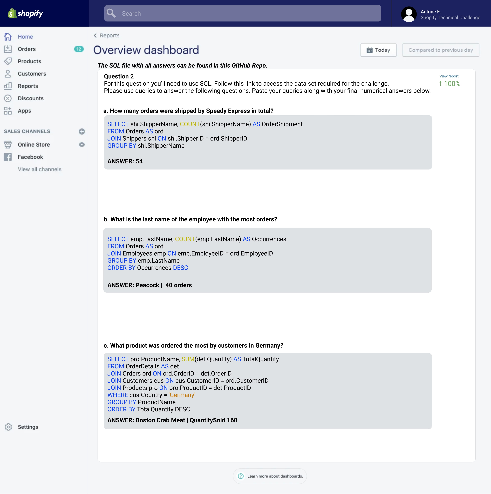

# Antone Evans Jr.
##  :snowflake: Winter 2022 Data Science Intern Challenge

<b> All working for the work presented can be found below: </b>
- Question 1: [Jupyter Notebook](https://github.com/antoneev/ShopifyTechnicalChallenge/blob/main/Question%201.ipynb)
- Question 2: [SQL File](https://github.com/antoneev/ShopifyTechnicalChallenge/blob/main/Question%202.sql)

# Answer in Photo
<b> Please scroll below to see answers in plain text. </b> 



# Answers Plain Text
## Question 1
### a. 
```python
# Order Sum
orderAmountSum = question1_dataset['order_amount'].sum()
orderAmountSum
5725640

# Total # of rows
totalItemsRowCount = question1_dataset['total_items'].count()
totalItemsRowCount
5000

# Calculate Incorect AOV
incorrectAOV = orderAmountSum / totalItemsRowCount
incorrectAOV = str(round(incorrectAOV, 2))
incorrectAOV
3145.13
```

The incorrect calculation is found by dividing by the total number of rows. The AOV is typically calculated by dividing the sum of sales (5725640) by the sum of items sold (43936). This would give us the value 357.92 (the mean). In addition, we can derive great information from the mode (153.00) and median (284.00) of the order amount column. 

### b.

As a metric is a single value, of the mean, mode and median.  I would report the mode. Although, I believe it is important to consider all 3 values and there relation to each others price point. As the mean can be skewed, due to outliers in pricing as within this dataset where the min value is $90, 25% - $163, 50% - 284, 75% - 390 and max value 704000. Therefore, the means price point does not always represent the data set as a whole. However, the mode represents the most common price point for items bought from a store. This allows us to see the best holistic view.


### c. 

<b> All metrics values were calculated and can be noted in my Juypter Notebook. </b>

```python
mode = question1_dataset['order_amount'].mode()[0]
mode
$153.00
```


## Question 2
### a.
```sql
SELECT shi.ShipperName, COUNT(shi.ShipperName) AS OrderShipment
FROM Orders AS ord
JOIN Shippers shi ON shi.ShipperID = ord.ShipperID
GROUP BY shi.ShipperName
```
<b> ANSWER: 54 </b>

### b.
```sql
SELECT emp.LastName, COUNT(emp.LastName) AS Occurrences 
FROM Orders AS ord
JOIN Employees emp ON emp.EmployeeID = ord.EmployeeID
GROUP BY emp.LastName
ORDER BY Occurrences DESC
```
<b> ANSWER: Peacock |  40 orders </b>

### c.
```sql
SELECT pro.ProductName, SUM(det.Quantity) AS TotalQuantity
FROM OrderDetails AS det
JOIN Orders ord ON ord.OrderID = det.OrderID
JOIN Customers cus ON cus.CustomerID = ord.CustomerID
JOIN Products pro ON pro.ProductID = det.ProductID
WHERE cus.Country = 'Germany'
GROUP BY ProductName
ORDER BY TotalQuantity DESC
```
<b> ANSWER: Boston Crab Meat | QuantitySold 160 </b>
